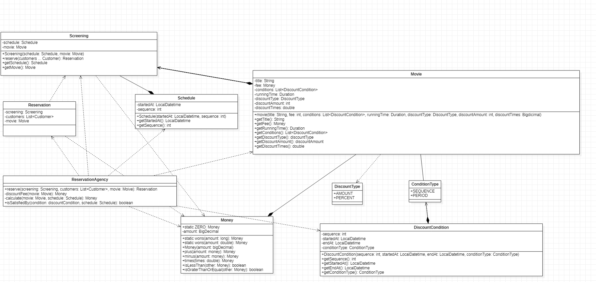

## 設計品質とトレードオフ

# データ中心の設計とは

クラス間の協力と役割を基に設計するのではなく、各々のクラスの状態を中心に設計すること。

クラスがどんなインスタンス変数を持つ必要があるかを中心に設計するパターン。

レガシーなコードでよく見かける実装パターンで実装しやすいが多くの問題を抱えている。

# データ中心の設計の問題

+ 役割(オブジェクトが協力の中で遂行する責任)中心ではなく、データ中心の設計をした場合は、内部実装(Private)も全部Publicとして公開するため、変更に弱い。
+ インスタンス変数をSetter,Getterを使ってカプセル化しているように見えますが、Setter,Getterが存在するのはインスタンス変数をPubilcとして公開していることと同じで結合度が高い。
+ 結合度が高く、凝集度が低いため、コードの変更が難しい。コードの変更が発生すると、いろんなところを修正することになりがち。

# UML 役割中心の設計 VS データ中心の設計

chapter02の役割中心の設計をデータ中心の設計に変更しました。
※ chapter02の詳細の内容は[こちら](/src/main/java/com/my/study/object/chapter02)を参考

+ 役割中心の設計UML

+ データ中心の設計UML

=>ReservationAgencyクラスとその以外のクラスはデータ中心のクラスで構成され、ReservationAgencyクラスでデータ中心のクラスを参照する設計パターン。

# 役割中心の設計 VS データ中心の設計でコード変更が発生した場合

仮の状況に対し、コードの変更箇所を比較

1. 割引条件(DiscountCondition)が一つ追加された場合
   1. 役割中心の設計
      1. DiscountConditionインタフェースを継承する今回追加されるクラス(xxxCondition)を追加する変更
   1. データ中心の設計
      1. DiscountConditionクラスに新たに新し割引条件用のメソッドを追加
      1. ConditionType(Enum)クラスに新しいフィールドを追加
      1. ReservationAgencyで割引条件関連ロジックの修正
1. 順番条件(SequenceCondition)クラスのフィールドSequenceのタイプがintからdoubleに変わった場合
   1. 役割中心の設計
      1. SequenceConditionクラスのSequenceフィールドのタイプとで割引条件関連ロジックの修正
   1. データ中心の設計
      1. DiscountConditionのSequenceフィールドを修正
      1. ReservationAgencyで割引条件関連ロジックの修正

