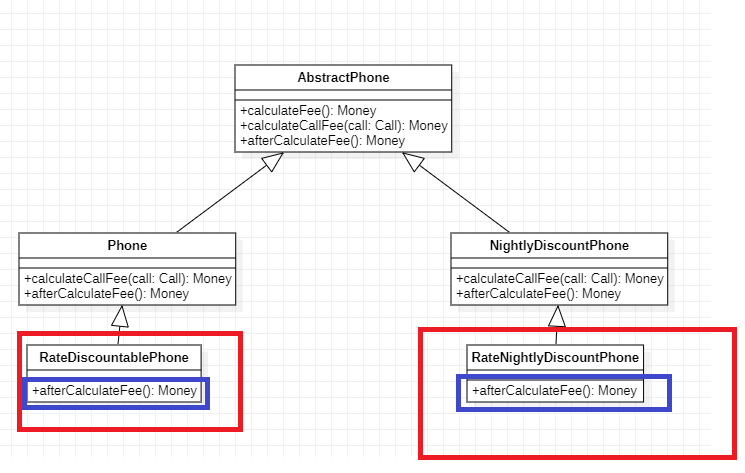
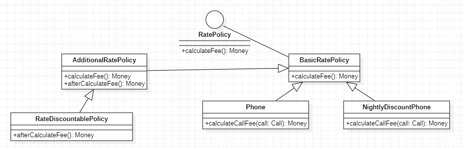

# コンポジション(Composition)と柔軟な設計

## 継承とコンポジション

設計の観点では継承よりコンポジションを使うべき。  
継承は子クラスが親クラスに強く依存する(is-a)関係の反面、コンポジションはクラスとクラスが協力(依存)する(has-a)関係になり、保守性が高いです。

## 継承による副作用

継承は色んな問題を抱えている。  
仮に、[10章](https://github.com/bittap/study/tree/main/src/main/java/com/my/study/object/chapter10)の通話料金計算プログラムで以下の要件が追加されたとする。

> 料金プラン計算後パーセントに割引をするサービス

今の料金プランは二つ[通常料金プラン(Phone)]と[深夜割引料金プラン(NightlyDiscountPhone)]がある。


上記の要件が追加された時のクラス図

各料金プランごとに新しいクラスを追加する必要がある

### 問題点
上記は以下の問題点が存在する。
+ 一つの機能を追加・修正するために多くのクラスを追加・修正することになる。  

上記のクラス図の赤枠を見ると一つの機能追加のために二つのクラスが追加されました。  
もし、料金プランが二つ[通常料金プラン]と[深夜割引料金プラン]ではなく、三つまたは四つの場合はその分クラスが増えてしまう。

+ 重複コードが発生する

上記のクラス図の青枠を見るとoverrideしたメソッドが存在する。  
そのメソッドの中の処理は「パーセントに割引をする」だけでどのクラスでも実装は同じですが、二つのクラスが存在して重複コードが発生する。

## 継承をコンポジション(Composition)に変更

上記の問題を解くコンポジション(Composition)に通話料金計算プログラムを変更する。  

まず、継承のクラス図  
.PNG)

継承をコンポジションに変更したクラス図。  


変更点
1. コンポジションを使うため、料金計算をインターフェース(RatePolicy)に変更しました。
2. 料金プラン計算後の割引をするサービス(AdditionalRatePolicy)がメンバー変数を見るとコンポジションを使い、料金計算クラス(BasicRatePolicy)と協力するようになりました。

### コンポジションクラスのコード

[料金計算インターフェース]

```
public interface RatePolicy {
	public Money calculateFee();
}
```

[基本料金計算]

```
public abstract class BasicRatePolicy {
	private List<Call> calls = new ArrayList<>();
	private double taxRate;

	public BasicRatePolicy(List<Call> calls, double taxRate){
		this.calls = calls;
		this.taxRate = taxRate;
	}

	public Money calculateFee() {
		Money result = Money.ZERO;
		
		for(Call call : calls){
			result = result.plus(calculateCallFee(call));
		}
		
		return result.plus(result.times(taxRate));
	}
	
	public abstract Money calculateCallFee(Call call);
}
```

[基本料金プラン(子クラス)]

```

public class Phone extend BasicRatePolicy {
	private Money amount;
	private Duration seconds;
	
	...
	
	@Overrride
	public Money calculateCallFee(Call call) {
		return amount.times(call.getDuration().getSeconds() / seconds.getSeconds()));
	}
}

```

[深夜割引料金プラン(子クラス)]

```

public class NightlyDiscountPhone extend BasicRatePolicy {
	private static final int LATE_NIGHT_HOUR = 23;
	private Money amount;
	private Money NigthlyAmount;
	

	@Overrride
	public Money calculateCallFee(Call call) {
		if (call.getFrom().getHour() >= LATE_NIGHT_HOUR) {
			result = result.plus(super.getAmount().minus(NigthlyAmount).times(call.getDuration().getSeconds() / seconds.getSeconds())));
		} else {
			return amount.times(call.getDuration().getSeconds() / seconds.getSeconds()));
		}
		
	}
}

```

[割引ポリシー]

```

public abstract AdditionalRatePolicy extend BasicRatePolicy {
	private BasicRatePolicy next;
	
	public RatePolicy(BasicRatePolicy next){
		this.next = next;
	}
	
	@Overrride
	public Money calculateFee(){
		Money money = next.calculateFee();
		return afterCalculateFee(money);
	}
	
	public abstract Money afterCalculateFee(Money money);
}
```

[パーセント割引ポリシー]

```

public class RateDiscountablePhone extend RatePolicy {
	private AbstractPhone phone;
	private Percent percent;
	
	public RateDiscountablePhone(AbstractPhone phone, Percent percent){
		this.phone = phone;
		this.percent = percent;
	}
	
	@Overrride
	public Money afterCalculateFee(Money money){
		return money.minus(money.times(percent));
	}
}
```


## 変更後の比較

[継承による副作用の問題点](https://github.com/bittap/study/tree/main/src/main/java/com/my/study/object/chapter11#%E5%95%8F%E9%A1%8C%E7%82%B9)の問題点二つがなくなるのが分かる。  
もし、要件に固定割引ポリシーが追加されたとして比較してみる。

[継承の場合]
.PNG)

[コンポジションの場合]
.PNG)

コンポジションは一つのクラス追加で対応できる
 且つ 重複コードが発生しないことが分かる。


## 感想

1. 実は本の中では[継承による副作用](https://github.com/bittap/study/tree/main/src/main/java/com/my/study/object/chapter11#%E7%B6%99%E6%89%BF%E3%81%AB%E3%82%88%E3%82%8B%E5%89%AF%E4%BD%9C%E7%94%A8)の内容はクラスと割引ポリシーが多くて複雑だったのです。  
しかし、 それを全部書くと長くなりますし、読みづらくなるかと思って私が必要なところだけ考えて少し変更を加えて書きました。  
それによりもっと理解しやくなったら、嬉しいです。  

2. プロジェクトで実装されたクラスを見るとほとんど継承よりコンポジションを使いました。
この章を参考してなぜコンポジションが多いか分かるようになってよかったです。
