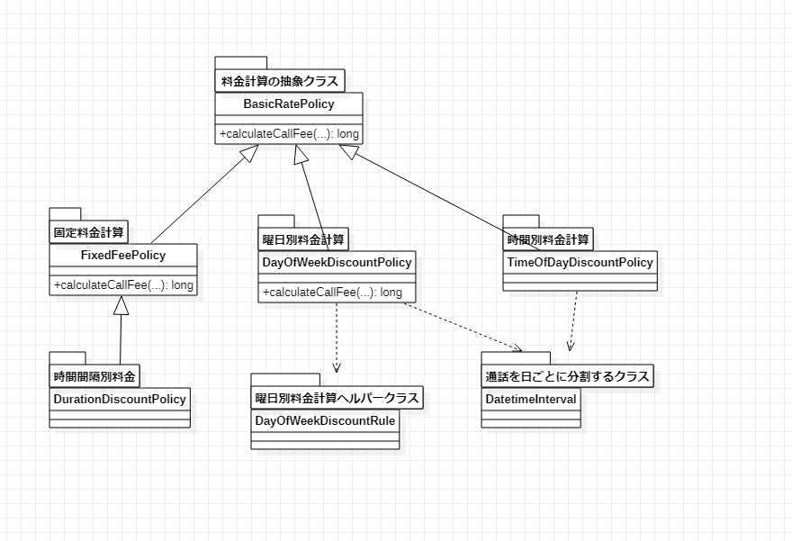
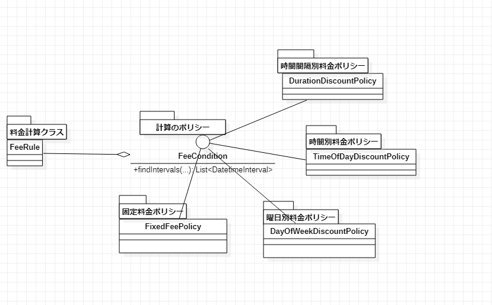

# 一貫性がある協力

クラスは協力のために存在する。  
協力が一貫性を保つ場合にはコードの構成が他のところと同じになります。   
それによりプログラマーは習うことが減ったりどのコード構成により実装するか悩むことがなくなります。

それではコードにより具体的に一貫性がない・ある場合を比較しましょう。  

## 一貫性がない場合

### プログラム
「一貫性がないコード」を見る前にどのプログラムか把握した上にコードを見たほうが理解しやすいと思います。   

まずプログラムについて説明します。  
プログラムは携帯の通話の料金を計算するプログラムです。   
そのプログラムはいろんな料金ポリシーによって携帯の通話料金を計算します。   
例えば、料金ポリシーには4種類が存在するとします。
1. 固定料金  
例) 30秒ごとに10円
2. 曜日別料金  
例) 
    + 平日は30秒ごとに10円
    + 週末は30秒ごとに20円
3. 時間別料金  
例) 
    + 0時~15時までは30秒ごとに10円
    + 15時~24時までは30秒ごとに20円
4. 時間間隔別料金  
例) 
    + 30分までは30秒ごとに10円
    + その以降は30秒ごとに20円

料金を計算するためには通話を各ポリシーの詳細の内容ごとに分割する必要があります。   
例えば、ポリシーは曜日別料金で通話は金曜日から土曜日までに通話したとする。   
その場合の計算方法は以下になります。

1. 通話が日を跨ぐ場合は日ごとに分割する
2. 曜日別料金ポリシーの条件に合ってはまる料金によって計算する

### コード

プログラムを説明するのが目的ではないです。   
目的は問題のところを共有するのが目的です。   
そのため、全体的にコードを並ぶのではなく問題なところのみ並びました。

・クラス図



・コード  
実装タイプは以下になります。  
 
<ol type="a">
  <li>親クラスを再利用  </li>
  <li>新しいクラスを作ってそれを利用 </li>
  <li>リストを利用  </li>
  <li>上記のどちらも使わない</li>
</ol>

各ポリシーの実装は以下になります。
コードを具体的に見る必要はなく、実装タイプを中心として見ていただければと思います。
1. 固定料金  
実装タイプ：d
```
@AllArgsConstructor
public class FixedFeePolicy extends BasicRatePolicy {

  private int amount;

  private Duration seconds;

  @Override
  protected long calculateCallFee(Call call) {
    return call.getDuration().getSeconds() / seconds.getSeconds() * amount;
  }
}
```

2. 曜日別料金  
実装タイプ：b
```
public class DayOfWeekDiscountPolicy extends BasicRatePolicy {

	private List<DayOfWeekDiscountRule> dayOfWeekDiscountRules;

	/**
	 * @param dayOfWeekDiscountRules
	 */
	public DayOfWeekDiscountPolicy(List<DayOfWeekDiscountRule> dayOfWeekDiscountRules) {
		this.dayOfWeekDiscountRules = dayOfWeekDiscountRules;
	}

	@Override
	protected long calculateCallFee(Call call) {
		long sumFee = 0L;
		for (Call oneDayCall : call.splitBy()) {
			for (DayOfWeekDiscountRule dayOfWeekDiscountRule : dayOfWeekDiscountRules) {
				sumFee += dayOfWeekDiscountRule.calculate(oneDayCall);
			}
		}

		return sumFee;
	}

}
```
曜日別料金ヘルパークラス
```
public class DayOfWeekDiscountRule {
    private List<DayOfWeek> dayOfWeeks;
    private Duration duration;
    private int amount;

    /**
     * @param dayOfWeeks
     * @param duration
     * @param amount
     */
    public DayOfWeekDiscountRule(List<DayOfWeek> dayOfWeeks, Duration duration, int amount) {
        this.dayOfWeeks = dayOfWeeks;
        this.duration = duration;
        this.amount = amount;
    }

    public Long calculate(Call oneDayCall) {
        if (dayOfWeeks.contains(oneDayCall.getFrom().getDayOfWeek())) {
            return oneDayCall.getDuration().getSeconds() / duration.getSeconds() * amount;
        }

        return 0L;
    }

}
```

3. 時間別料金  
実装タイプ：c
```
public class TimeOfDayDiscountPolicy extends BasicRatePolicy {

  private List<LocalTime> froms;

  private List<LocalTime> tos;

  private List<Duration> durations;

  private List<Long> fees;

  @Override
  protected long calculateCallFee(Call call) {
    long sumFee = 0L;
    for (Call callDay : call.splitBy()) {
      for (int i = 0; i < froms.size(); i++) {
        LocalTime timeFrom = froms.get(i);
        LocalTime timeTo = tos.get(i);

        // 基準時間が開催時間前
        LocalTime starTime = getFrom(timeFrom, callDay);
        LocalTime endTime = getTo(timeTo, callDay);

        Duration duration = Duration.between(starTime, endTime);
        long seconds = duration.getSeconds();
        sumFee += seconds / durations.get(i).getSeconds() * fees.get(i);
      }
    }

    return sumFee;
  }

  ...
}
```

4. 時間間隔別料金  
実装タイプ：a
```
public class DurationDiscountPolicy extends FixedFeePolicy {

  private Duration from;

  private Duration to;

  /**
   * @param from
   * @param to
   */
  public DurationDiscountPolicy(Duration from, Duration to, int amount, Duration seconds) {
    super(amount, seconds);
    this.from = from;
    this.to = to;
  }

  @Override
  protected long calculateCallFee(Call call) {
    long sumFee = 0L;

    if (call.getDuration().compareTo(to) > 0) {
      return sumFee;
    }

    if (call.getDuration().compareTo(from) < 0) {
      return sumFee;
    }

    LocalDateTime fromLdt = call.getFrom().plus(from);
    LocalDateTime toLdt = call.getDuration().compareTo(to) > 0 ? call.getFrom().plus(to) : call.getTo();

    return super.calculateCallFee(new Call(fromLdt, toLdt));
  }

}
```

### 問題
上記のクラスの問題は各ポリシーごとに実装方法がばらばらなことです。  
そのため、「2. 曜日別料金 」を理解しても「4. 時間間隔別料金」の場合は新しいコードだと感じてしまいます。  
もし、新しいポリシーが追加された場合に上記の実装タイプa,b,c,dどちらの方法でも実装可能だとします。   
その場合、プログラマーはどの実装方法で実装すればよいか迷ってしまいます。


## 一貫性があるコード

### 改善方法
変更するところは変更しないところから分離して抽象化する。  
逆に変更しないところは共通化する。  

変更するところは以下の例の中で` `になります。  
変更しないところは以下の例の中で平文になります。  
1. 固定料金  
例) `30秒`ごとに10円
2. 曜日別料金  
例) 
    + `平日は30秒`ごとに10円
    + `週末は30秒`ごとに20円
3. 時間別料金  
例) 
    + `0時~15時までは30秒`ごとに10円
    + `15時~24時までは30秒`ごとに20円
4. 時間間隔別料金  
例) 
    + `30分までは30秒`ごとに10円
    + `その以降は30秒`ごとに20円

### コード

・クラス図

変更するところはFeeConditionというインタフェースを定義して抽象化する。
逆に、変更しないところはFeeRuleというクラスを定義して共通化しました。




・コード

+ FeeRule
```
@AllArgsConstructor
public class FeeRule {

    private FeePerDuration feePerDuration;

    private FeeCondition feeCondition;

    public long calculateRuleFee(Call call) {
        return feeCondition.findIntervals(call).stream()
                .map(e -> feePerDuration.calculate(e))
                .reduce(0L, (first, second) -> first + second);
    }
}
```
+ FeeCondition
```
public interface FeeCondition {

    public List<DatetimeInterval> findIntervals(Call call);
}
```

1. 固定料金  
```
@AllArgsConstructor
public class FixedFeeCondition implements FeeCondition {

    @Override
    public List<DatetimeInterval> findIntervals(Call call) {
        return Arrays.asList(call.getDatetimeInterval());
    }
}
```

2. 曜日別料金  
```
@AllArgsConstructor
public class DayOfWeekFeeCondition implements FeeCondition {

    private List<DayOfWeek> dayOfWeeks;

    @Override
    public List<DatetimeInterval> findIntervals(Call call) {
        List<DatetimeInterval> intervals = new ArrayList<>();
        for (DatetimeInterval interval : call.splitBy()) {
            if (dayOfWeeks.contains(interval.getFrom().getDayOfWeek())) {
                intervals.add(interval);
            }
        }

        return intervals;
    }
}
```

3. 時間別料金  
```
@AllArgsConstructor
public class TimeOfDayFeeCondition implements FeeCondition {

    private LocalTime from;

    private LocalTime to;

    @Override
    public List<DatetimeInterval> findIntervals(Call call) {
        List<DatetimeInterval> intervals = new ArrayList<>();
        for (DatetimeInterval interval : call.splitBy()) {
            LocalTime starTime = getFrom(from, interval);
            LocalTime endTime = getTo(to, interval);

            intervals.add(DatetimeInterval.of(LocalDateTime.of(interval.getFrom().toLocalDate(), starTime),
                    LocalDateTime.of(interval.getTo().toLocalDate(), endTime)));
        }

        return intervals;
    }

    ...
}
```

4. 時間間隔別料金  
```
@AllArgsConstructor
public class DurationFeeCondition implements FeeCondition {

    private Duration from;

    private Duration to;

    @Override
    public List<DatetimeInterval> findIntervals(Call call) {
        if (call.getDatetimeInterval().getDuration().compareTo(from) < 0) {
            return Collections.emptyList();
        }

        return Arrays.asList(DatetimeInterval.of(
                call.getDatetimeInterval().getFrom().plus(from),
                call.getDatetimeInterval().getDuration().compareTo(to) > 0
                        ? call.getDatetimeInterval().getFrom().plus(to)
                        : call.getDatetimeInterval().getTo()));
    }
}
```


### 改善後

クラス図を比べます。   

・ 改善後  


・ 改善前  


改善後は一貫性が保って実装方法が同じのように見えます。  
実際に各ポリシーはインタフェースによって一貫性がある協力を保つことになりました。   
もうプログラマーは新しいポリシーが追加されてもどの実装方法を使うか悩まなくてよいことになりました。

## 感想

作者は一番大事なことは設計が一貫性を保つことだと言いました。   
一貫性を保たないとコードは理解する時に毎回新しいことだと感じながら学習する必要があるためです。    

私はプロジェクトでいい設計方法があれば直したりしましたが、やはりいい設計方法より一貫性を保つことが大事だと感じました。  

また、作者は新要件が追加されて今の一貫性では要件対応ができない場合は
新要件だけに対応するコードを追加するよりコードをリファクトリングして旧と新要件全部に一貫性を保たせるようにすることが大事だと言いました。

私も同じ考えです。  
開発時に未来の全ての要件を吸収できるようなコードは存在しないです。   
重要なことはコードも要件によって変化していくのは当たり前だと思うことです。
